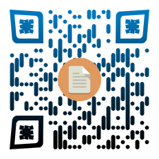
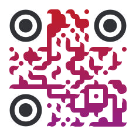
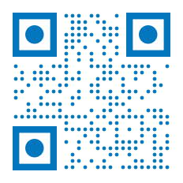

# QRlib

done

QRlib is an pure python qr code generator which can be used to create simple QR code , designer QR code or trackable QR codes


## What is a QR Code?


A Quick Response code is a two-dimensional pictographic code used for its fast readability and comparatively large storage capacity. The basic QR code consists of black modules arranged in a square pattern on a white background. The information encoded can be made up of any kind of data (e.g., binary, alphanumeric, or Kanji symbols).


## Installation


you can install QRlib with pip command
```bash
pip install QRlib
```
or with pip3
```bash
pip3 install QRlib
```

## Requirements


* python 3.4 or above
* [requests module](https://pypi.org/project/requests/)
* [tqdm module](https://pypi.org/project/tqdm/)
* [svglib module](https://pypi.org/project/svglib/)
* [reportlab module](https://pypi.org/project/reportlab/)
* [urllib module](https://pypi.org/project/urllib3/)

## Command Line Arguments
* ##### to update QRlib to latest version
    * ```python -m QRlib --update```

    * ```python -m QRlib -u```
* ##### to get help on module QRlib
    * ```python -m QRlib --help```

    * ```python -m QRlib -h```

## Importing QRlib


import QRlib with command
```python
from QRlib.QRlib import *
```

## Generating QR codes

###### *Classic QR*


|  |
|:------:|
|    ```classic```    |


```python
from QRlib.QRlib import *

img_name = "ClassicQR" # name of Qr without extension of image ( default to png )
qr_data = "this is an classic qr" # content of qr
size = 200 # size in pixal ( optional )

qr.classic(qr_data, img_name, size=size)
```

___
###### *Tansparent QR*


|  |
|:------:|
|    ```transparent```    |


```python
from QRlib.QRlib import *

img_name = "TransparentQR" # name of Qr without extension of image ( default to png )
qr_data = "this is an Transparent qr" # content of qr
img_url = "https://raw.githubusercontent.com/Himanshu-Cyber-Code/QRlib/master/images/QR_sample_QRlib/transparent_test.png" # url for the image ( optional )
size = 200 # size in pixal ( optional )

qr.transparent(qr_data, img_name, img=img_url, size=size)
```

-------


###### *Clear QR*


|  |
|:------:|
|    ```clear```    |


```python
from QRlib.QRlib import *

img_name = "ClearQR" # name of Qr without extension of image ( default to png )
qr_data = "this is an Clear qr" # content of qr
size = 200 # size in pixal ( optional )

qr.clear(qr_data, qr_name, size=size)
```
-------
###### *Custom QR*

|  |  |  |  |  |  |  |  |  |  |   |  |  |  |  |  |   |
|:------:|:------:|:------:|:------:|:------:|:------:|:------:|:------:|:------:|:------:|:------:|:------:|:------:|:------:|:------:|:------:|:------:|
|    ```Custom_1```    |        |    ```Custom_2```    |        |    ```Custom_3```    |        |    ```Custom_4```    |        |    ```Custom_5```    |        |    ```Custom_6```    |        |    ```Custom_7```    |        |    ```Custom_8```    |        |    ```Custom_9```    |


And +1000 More Design`s

```python
# An Minimum Example

from QRlib.QRlib import *

img_name = "CustomQR" # name of Qr without extension of image ( default to png )
qr_data = "this is an Custom qr" # content of qr

qr.custom(qr_data, qr_name)
```

```python
# An Maximum Example

from QRlib.QRlib import *

img_name = "CustomQR" # name of Qr without extension of image ( default to png )
qr_data = "this is an Custom qr" # content of qr

qr.custom(
qr_data,
qr_name,
body=5,  # Pattern Of QR Body
frame=13,  # Eye Frame Pattern
ball=15,  # QR Eye Ball Pattern
bodycolor=(148,143,32),  # Colour For QR Body
bgcolor=(255,255,255),  # QR Back Ground Colour
ballcolor=(26,26,56),  # QR Eye Ball Colour
framecolor=(3,190,242),  # QR Frame Colour
shadecolor=(41,136,161),  # Colour Of Other  Shade Which Will Be Mix With Body Colour
shadeonball=True,  # If Shade Has To Be Applied On Eye Balls of Qr
shadetype=0,  # Type Of shade From Linear Or Radial
logo='https://raw.githubusercontent.com/Himanshu-Cyber-Code/QRlib/master/images/QR_sample_QRlib/transparent_test.png',  # Logo On Qr ( URL )
size=200 # Size For Qr
)
```


|  Body Design  |  No. |    |  Frame Design   |  No.   |     |  Ball Design  |  No.  |
|:------:|:------:|:------:|:------:|:------:|:------:|:------:|:------:|
|         |    0     |    |         |    0     |    |         |    0     |
|         |    1     |    |         |    1     |    |         |    1     |
|         |    2     |    |         |    2     |    |         |    2     |
|         |    3     |    |         |    3     |    |         |    3     |
|         |    4     |    |         |    4     |    |         |    4     |
|         |    5     |    |         |    5     |    |         |    5     |
|         |    6     |    |         |    6     |    |         |    6     |
|         |    7     |    |         |    7     |    |         |    7     |
|         |    8     |    |         |    8     |    |         |    8     |
|         |    9     |    |         |    9     |    |         |    9     |
|        |    10    |    |        |    10    |    |        |    10    |
|        |    11    |    |        |    11    |    |        |    11    |
|        |    12    |    |        |    12    |    |        |    12    |
|        |    13    |    |        |    13    |    |        |    13    |
|        |    14    |    |        |    14    |    |        |    14    |
|        |    15    |    |                                                                      |          |    |        |    15    |
|        |    16    |    |                                                                      |          |    |        |    16    |
|        |    17    |    |                                                                      |          |    |        |    17    |
|        |    18    |    |                                                                      |          |    |                                                                   |          |
|        |    19    |    |                                                                      |          |    |                                                                   |          |
|        |    20    |    |                                                                      |          |    |                                                                   |          |
|        |    21    |    |                                                                      |          |    |                                                                   |          |


___
###### Web Qr
