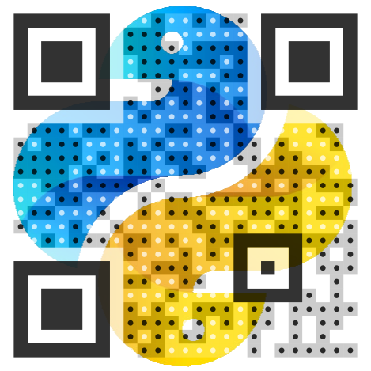
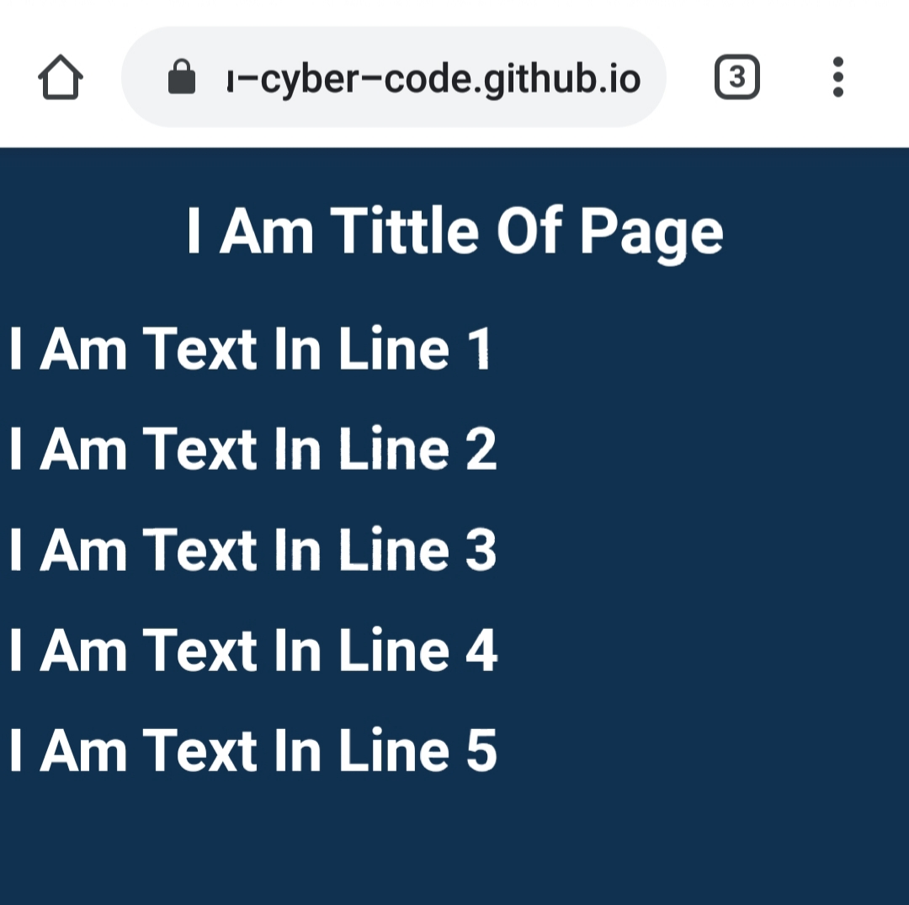

# QRlib

QRlib is an pure python qr code generator which can be used to create simple QR code , designer QR code or trackable QR codes


## What is a QR Code?


A Quick Response code is a two-dimensional pictographic code used for its fast readability and comparatively large storage capacity. The basic QR code consists of black modules arranged in a square pattern on a white background. The information encoded can be made up of any kind of data (e.g., binary, alphanumeric, or Kanji symbols).


## Installation


you can install QRlib with pip command
```bash
pip install QRlib
```
or with pip3
```bash
pip3 install QRlib
```

## Requirements


* python 3.4 or above
* [requests module](https://pypi.org/project/requests/)
* [tqdm module](https://pypi.org/project/tqdm/)
* [svglib module](https://pypi.org/project/svglib/)
* [reportlab module](https://pypi.org/project/reportlab/)
* [urllib module](https://pypi.org/project/urllib3/)

## Command Line Arguments
* ##### to update QRlib to latest version
    * ```python -m QRlib --update```

    * ```python -m QRlib -u```
* ##### to get help on module QRlib
    * ```python -m QRlib --help```

    * ```python -m QRlib -h```

## Importing QRlib


import QRlib with command
```python
from QRlib.QRlib import *
```

## Generating QR codes

###### *Classic QR*


|  |
|:------:|
|    ```classic```    |


```python
from QRlib.QRlib import *

img_name = "ClassicQR" # name of Qr without extension of image ( default to png )
qr_data = "this is an classic qr" # content of qr
size = 200 # size in pixal ( optional )

qr.classic(qr_data, img_name, size=size)
```

___
###### *Tansparent QR*


|  |
|:------:|
|    ```transparent```    |


```python
from QRlib.QRlib import *

img_name = "TransparentQR" # name of Qr without extension of image ( default to png )
qr_data = "this is an Transparent qr" # content of qr
img_url = "https://raw.githubusercontent.com/Himanshu-Cyber-Code/QRlib/master/images/QR_sample_QRlib/transparent_test.png" # url for the image ( optional )
size = 200 # size in pixal ( optional )

qr.transparent(qr_data, img_name, img=img_url, size=size)
```

-------


###### *Clear QR*


|  |
|:------:|
|    ```clear```    |


```python
from QRlib.QRlib import *

img_name = "ClearQR" # name of Qr without extension of image ( default to png )
qr_data = "this is an Clear qr" # content of qr
size = 200 # size in pixal ( optional )

qr.clear(qr_data, qr_name, size=size)
```
-------
###### *Custom QR*

|  |  |  |  |  |  |  |  |  |  |   |  |  |  |  |  |   |
|:------:|:------:|:------:|:------:|:------:|:------:|:------:|:------:|:------:|:------:|:------:|:------:|:------:|:------:|:------:|:------:|:------:|
|    ```Custom_1```    |        |    ```Custom_2```    |        |    ```Custom_3```    |        |    ```Custom_4```    |        |    ```Custom_5```    |        |    ```Custom_6```    |        |    ```Custom_7```    |        |    ```Custom_8```    |        |    ```Custom_9```    |


And +1000 More Design`s

```python
# An Minimum Example

from QRlib.QRlib import *

img_name = "CustomQR" # name of Qr without extension of image ( default to png )
qr_data = "this is an Custom qr" # content of qr

qr.custom(qr_data, qr_name)
```

```python
# An Maximum Example

from QRlib.QRlib import *

img_name = "CustomQR" # name of Qr without extension of image ( default to png )
qr_data = "this is an Custom qr" # content of qr

qr.custom(
qr_data,
qr_name,
body=6,  # Pattern Of QR Body
frame=5,  # Eye Frame Pattern
bodyc7,  # QR Eye Ball Pattern
bodycolor=(17, 49, 81),  # Colour For QR Body
bgcolor=(255, 255, 255),  # QR Back Ground Colour
ballcolor=(17, 49, 81),  # QR Eye Ball Colour
framecolor=(17, 49, 81),  # QR Frame Colour
shadecolor=(17, 49, 81),  # Colour Of Other  Shade Which Will Be Mix With Body Colour
shadeonball=True,  # If Shade Has To Be Applied On Eye Balls of Qr
shadetype=0,  # Type Of shade From Linear Or Radial
logo='https://raw.githubusercontent.com/Himanshu-Cyber-Code/QRlib/master/images/QR_sample_QRlib/transparent_test.png',  # Logo On Qr ( URL )
size=200 # Size For Qr
)
```


|  Body Design  |  No. |    |  Frame Design   |  No.   |     |  Ball Design  |  No.  |
|:------:|:------:|:------:|:------:|:------:|:------:|:------:|:------:|
|         |    0     |    |         |    0     |    |         |    0     |
|         |    1     |    |         |    1     |    |         |    1     |
|         |    2     |    |         |    2     |    |         |    2     |
|         |    3     |    |         |    3     |    |         |    3     |
|         |    4     |    |         |    4     |    |         |    4     |
|         |    5     |    |         |    5     |    |         |    5     |
|         |    6     |    |         |    6     |    |         |    6     |
|         |    7     |    |         |    7     |    |         |    7     |
|         |    8     |    |         |    8     |    |         |    8     |
|         |    9     |    |         |    9     |    |         |    9     |
|        |    10    |    |        |    10    |    |        |    10    |
|        |    11    |    |        |    11    |    |        |    11    |
|        |    12    |    |        |    12    |    |        |    12    |
|        |    13    |    |        |    13    |    |        |    13    |
|        |    14    |    |        |    14    |    |        |    14    |
|        |    15    |    |                                                                      |          |    |        |    15    |
|        |    16    |    |                                                                      |          |    |        |    16    |
|        |    17    |    |                                                                      |          |    |        |    17    |
|        |    18    |    |                                                                      |          |    |                                                                   |          |
|        |    19    |    |                                                                      |          |    |                                                                   |          |
|        |    20    |    |                                                                      |          |    |                                                                   |          |
|        |    21    |    |                                                                      |          |    |                                                                   |          |


___
###### Web Qr


|  |  |
|:------:|:------:|
|    ```Web QR```    |    [Link In QR](https://is.gd/mczMv4)    |


```python
# Web QR are online And Can Be Used In Track Data To Get Trackable QR ( Details On Track Data Bellow )
from QRlib.QRlib import *

img_name = "WebQR" # name of Qr without extension of image ( default to png )
qr_data = ["line 1", "line 2", "line 3", "line 4", "line 5"] # content of web qr should be list of string each string represents line break ( maximum line is 5 )
tittle = "i am tittle" # tittle of the web page ( optional )

qr.web(qr_data, img_name, tittle=tittle)
```

###### fast_design QR

custom QR very hard to design every time because of their large options so there is the solution. 

```python
# Generate a json containing the design for custom QR with commannd
# And Use It In Future As A Template

from QRlib.QRlib import *

generate.json_custom(

)

```

To Use It

```python
from QRlib.QRlib import *

json_file_path = r"C:/My/Path/To/json_file.json"

qr.fast_design(qr_data, img_name, json_file_path)
```

## Types Of Data For QR

Data In QR Are In Special Formats Which Is Readable By QR Scanners.
Some Can Be Generated By These Commands
to use them place them in the qr_data fields of qr

###### Text Data

```python
from QRlib.QRlib import *
data.text("Some Text")
```

###### URL Data

```python
from QRlib.QRlib import *
data.url("https://example.com")

# if the url is much big then you can short it with adding a command short=True
data.url("https://example.com", short=True) # this will return a url some thing like https://is.gd/abcdef ( no matter how big is url )
```

###### Email Data

```python
from QRlib.QRlib import *
email = "example@example.com"
subject = "i am the subject of email"
message = "i am the body of email"
data.email(email, subject = subject, message = message)
```

###### Phone Data

```python
from QRlib.QRlib import *
phone_number = "+919998887766"
data.phone(phone_number)
```

###### SMS Data

```python
from QRlib.QRlib import *
phone_number = "+919998887766"
message = "i am message for the sms"
data.sms(phone_number, message=message)
```

###### vcard Data

vcard are use in two versions to specify the version use command data.vcard2 or data.vcard3

```python
from QRlib.QRlib import *

first_name = "First_Name"

data.vcard2(
firs_tname, 
lastname="Last_Name",                #( optional )
position="my position",              #( optional )
work="Job",                          #( optional )
org="my Organization",               #( optional )
website="https://example.com",       #( optional )
email="example@example.com",         #( optional )
phone="+918887776655",               #( optional )
homephone="+913332225577",           #( optional )
workphone="+912223336655",           #( optional )
homefax="56282",                     #( optional )
workfax="53794",                     #( optional )
city="MyCity",                       #( optional )
state="MyState",                     #( optional )
country="MyCountry",                 #( optional )
zipcode="836619",                    #( optional )
street="MyStreet,                    #( optional )
)
```

###### Location Data

```python
from QRlib.QRlib import *
Latitude = 4637368
Longitude = 4827636
data.location(Latitude, Longitude)
```

###### Wifi Data

```python
from QRlib.QRlib import *
wifi("ssid", "password", encryption=0) # 0='nopass' , 1='WPA' , 2='WEP'
```

###### Event Data

```python
from QRlib.QRlib import *

tittle = "Event Tittle"
location = "My Location"

data.event(
tittle, 
location=location, 
start=[2020,6,16,11,54], # default is current time (start time of event) ([year,month,date,hour,minute])
end=[2020,6,16,11,54], # default is current time (end time of event) ([year,month,date,hour,minute])
)
```

###### Mecard Data

```python
from QRlib.QRlib import *

First_Name = "FirstName"

mecard(
First_Name, 
lastname="lastname", 
nickname="Nick Name",                   #( optional )
email="Email@Email.com",                #( optional )
phone1="+5366647168",                   #( optional )
phone2="+474725367158",                 #( optional )
phone3="+467835357471",                 #( optional )
dob=[2020,6,16], #(year,month,date)     #( optional )
note="a short note",                    #( optional )
city="city",                            #( optional )
state="state",                          #( optional )
country="country",                      #( optional )
zipcode="536829",                       #( optional )
street="MyStreet,                       #( optional )
)
```

###### Host data

this is a special type of data which can be use to put upto _100GB_ of data in a QR
for this you just need a email account

STEPS :-

* make a gmail account
* you will get 15GB of free space on google drive
* on google drive make a folder named QRlib
* now upload the file(images,APK,pdf,etc) which you want to put in QR
* then write the following command
* they will get hosted on internet with a direct URL which will be put in QR

```python
from QRlib.QRlib import *
email = "example@example.com"
file = "QRlib.png"
data.host(email ,file)
```

###### Trace URL data

